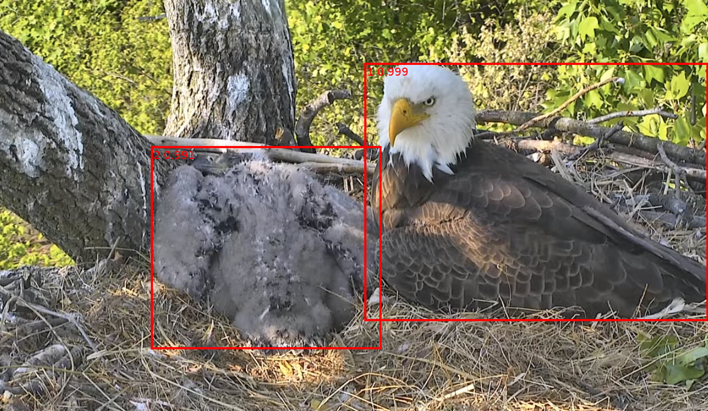
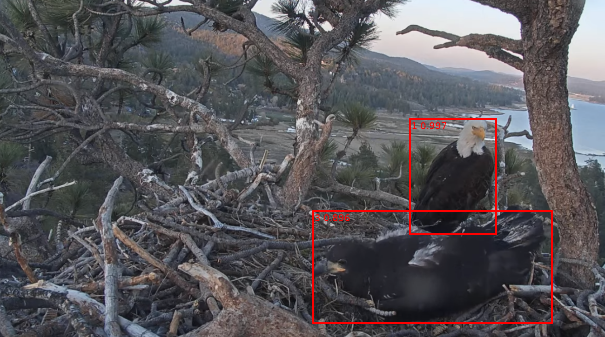

# BEAM Project

## Overview

This repo contains the code written for the Bald Eagle Automated Monitoring project. The goal of this project is to train a model capable of detecting and classifying Eagles and their prey items in nest camera footage.



## Implementation Details

#### Data
We collected a dataset of hundreds of thousands of images from several nest cameras over the course of the 2022 mating season. The images were collected, with permission, using a Youtube web scraper. A dataset of 717 images sampled evenly from each nest were labeled by hand into 12 classes:
* Eagle_Adult
* Eagle_Chick
* Eagle_Egg
* Eagle_Juvenile
* Eagle_Unknown
* Food_Bird
* Food_Fish
* Food_Mammal
* Food_Reptile
* Food_Unidentified
* Invalid_Bad_Image
* Invalid_Empty_Nest

However, due to limitations in the amount of training data available, we decided to reduce the dataset to the following 5 classes across 588 images:
* Eagle_Adult
* Eagle_Chick
* Eagle_Juvenile
* Food

Class label distribution:
|| Eagle_Adult | Eagle_Chick | Eagle_Juvenile | Food |
|----------------|-------------|---------------|----------------|------|
| Labels | 393 | 160 | 238 | 61 |

#### Model
We used the standard PyTorch implementation of a Faster R-CNN object detection model with a ResNet-50-FPN backbone. This model was chosen due to its modular design which made it ideal for fine-tuning, effective performance in early testing, and its performance on object detection benchmark challenges. 

#### Training
We used the PyTorch Lightning framework to train the model. This framework allowed us to iterate quickly and log metrics easily. We also used data augmentation to reduce overfitting. Augmentations: Horizontal Flips, and Scaled Jitter

Several candidate models were trained and evaluated on a 20% hold-out validation set. The best model was chosen based on the following metrics: mAP, mAR10, and per class mAP.

The best model was trained for 40 epochs using SGD with a learning rate of 5e-3, weight decay of 5e-4, and momentum of 0.9. A StepLR scheduler was used to reduce the learning rate by a factor of 0.1 every 9 epochs. The model was trained on a Google Cloud VM with a Nvidia T4 GPU. 

## Results

#### Training Graphs


#### Final Model Evaluation Metrics

##### Metrics on Validation Set

| Metric     | Value |
|------------|-------|
| mAP        | 0.42  |
| mAR10      | 0.61  |

Per Class mAP:
| Background | Adult | Juvenile | Chick | Food |
|------------|-------|----------|-------|------|
| 0.25       | 0.70  | 0.27     | 0.45  | 0.25 |

<!-- ##### Metrics on Full Dataset

| Metric     | Value |
|------------|-------|
| mAP        | 0.70  |
| mAR10      | 0.78  |

Per Class mAP:
| Background | Adult | Juvenile | Chick | Food |
|------------|-------|----------|-------|------|
| 0.22       | 0.65  | 0.26     | 0.37  | 0.22 | -->

#### Successful Examples From Validation Set





#### Failed Examples


## Future work
The, and most impactful step, towards improving the performance of this model would be to **label more data**. The model was trained on a relatively small dataset, and the results reflect this. It was able to detect and classify adult eagles with a high degree of accuracy, but struggled with juveniles and classifying food items which had a limited number of examples. The inclusion of **more nests** into the training data would further improve the model's generalizability so that it could be used on nests it was not trained on.

In this larger dataset it would also be important to create **more balanced classes**. Especially, the balance between juvenile and eagle chicks would be important as the difference between the two is subtle in the period of time before chicks fledge and become juveniles. In addition, with the larger dataset it could potentially possible to split the Food class into **more specific prey types** such as fish, birds, mammals, reptiles as originally intended. This would provide more meaningful data for research purposes.


## Setup

#### Creating Google Cloud VM

- Open compute engine dashboard
- Select marketplace and search for: "Deep Learning VM" or "Pytorch" select the google click to deploy ML vm and hit launch
- Suggested compute settings GPU: Nvidia T4, Machine Type: n1-standard-2
- Set framework to be: "PyTorch 1.12 (CUDA 11.3)"
- Select "Install NVIDIA GPU driver automatically on first startup?"
- Bootdisk as large as needed 150gb suggested to start

#### Adding SSH key to VM

- Open compute engine metadata page
- Click on ssh keys tab, add personal ssh key

#### Starting Server
- got to compute engine dashboard
- start resume beam-gpu instance
- refresh page after 15 seconds
- copy external ip

#### Conntecting from vs-code
-Install remotes explorer in vscode
-Add server ip to vscode remotes
-Password for ssh key may be required
-Open folder /home/kamranzolfonoon/

#### On VM setting up clean repo:
- Clone repo from github
- In repo run: `conda env create -f env.yml`
- Then `activate conda env`

## Useful Commands

#### Getting data out of a bucket

`gcloud storage cp -r BUCKET_NAME .`

#### Add swap (if model training fails try this)

In terminal:
```bash
sudo swapon --show
sudo fallocate -l 4G /swapfile
sudo chmod 600 /swapfile
sudo mkswap /swapfile
sudo swapon /swapfile
sudo swapon --show
```
